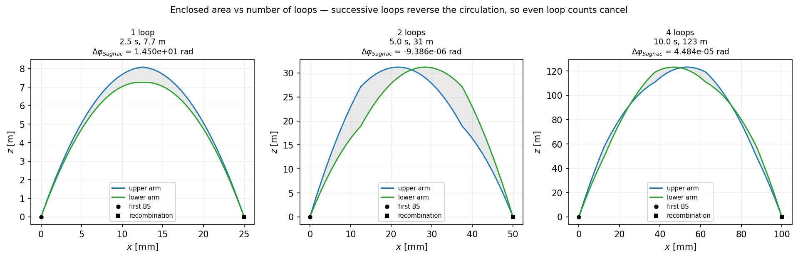

# AIS++ v0.0.1

## Branch compatibility

| aispp branch | works with aispy branch | description |
|---|---|---|
| `phase-space-grid` | `psmap-surrogate` | Phase space grid (`psgrid`) init mode, PSMAP output, GPU surrogate |
| `trajectory-plots` *(this branch)* | `trajectory-plots` | Trajectory snapshots (`printtrajectory`) and spacetime diagram plotting |

The `trajectory-plots` branch is based on `phase-space-grid` and includes all its changes.

Atom Interferometry Simulator in C++ (AIS++) is a compiled semi-classical simulation framework
for modelling atom interferometry sequences in arbitrary inertial and laser potentials.

## Table of Contents

- [Introduction](#introduction)
- [Dependencies](#dependencies)
- [Installation](#installation)
- [Usage](#usage)
- [Contributing](#contributing)
- [References](#references)
- [License](#license)

## Introduction

Light-pulse atom interferometry exploits interference between atomic wavepackets travelling along
spatially separated paths. Laser pulses coherently split, redirect, and recombine the wavepackets,
enabling precision measurement of external forces and fields. See [1] for background.

AIS++ uses a **semi-classical model**: atoms are treated as point-like particles following
classical trajectories, while their internal states evolve as a quantum-mechanical two-level
system. Each atom follows two trajectories (upper and lower interferometer arms), accumulating a
complex phase along each. The total interferometric phase difference $\Delta\varphi$ between the
arms determines the probability of detecting the atom in each output port.

The simulation has two alternating stages:

- **Free propagation.** Between pulses, AIS++ integrates Hamilton's equations of motion
  numerically (GSL adaptive ODE solvers) to advance the atom's centre-of-mass coordinates and
  accumulate the kinematic phase (classical action). The laser frequency contribution to the
  phase is carried in `__float128` quad precision to avoid catastrophic cancellation at optical
  frequencies ($\omega_0 T \sim 10^{15}$ rad).

- **Beam-splitter pulses.** During each laser pulse, AIS++ solves the time-dependent
  Schrödinger equation for the two-level internal state in the presence of a spatially varying
  laser field. The position-dependent Rabi frequency, laser phase, and wavefront gradient all
  enter the dynamics. This yields updated internal-state amplitudes and phases for each
  wavepacket. The mathematical derivation of this step — including the unitary transformation
  chain that reduces the full atom–light Hamiltonian to a tractable ODE — is given in
  [THEORY.md](THEORY.md).

At the end of the sequence, interfering wavepacket pairs are identified and their phase difference
is extracted. Results are written to HDF5 for analysis with **aispy**.

Version 0.0.1 uses a Gaussian wavefront and intensity profile. An `ultrafast` mode is available
which skips the classical action phase accumulation to accelerate simulations focused on wavefront
effects.


*Phase-shear readout (PSR) output from a standard ($n=1$) Mach–Zehnder interferometer
with 1 000 000 atoms ($T = 2.225$ s, $\kappa_\mathrm{PSR} = 3140$ rad/m). Top: 2-D atom
density in the transverse plane — the grating-like fringes encode the interferometer phase.
Bottom: $x$-projection with fitted fringe model (pink, $C = 0.99$) and Gaussian envelope (dashed).
Generated by running `ais++ -i input-files/PSR_EXAMPLE_NLMT1.aisi -o output-files/PSR_EXAMPLE_NLMT1.h5`.*

## Rotating frames (Coriolis)

The `rotating_pot`, `rotating_linear_pot` and `rotating_quadratic_pot` potentials add the
Coriolis and centrifugal forces of a frame rotating at a constant $\vec\Omega$, set with the
`rotation` input key. See [INPUT_REFERENCE.md](INPUT_REFERENCE.md#rotating-frame) for the
input syntax and the conventions.

Internally the Hamiltonian becomes $H = p^2/2m - \vec\Omega\cdot(\vec r\times\vec p) + V$, which
makes it the first potential in ais++ with a genuine velocity dependence. Everything at the
input and output boundaries stays in ordinary frame velocities $\dot{\vec r}$, and $\vec\Omega=0$
reproduces the inertial potentials bit for bit.


*Interferometer arms in position space at Earth rotation rate (latitude 45°), projected onto the
$x$–$y$, $x$–$z$ and $y$–$z$ planes. The arm separation is exaggerated by the stated factor so the
loop is visible — the quoted areas are the true ones. The shaded area $A_y$ gives the Sagnac phase
$\Delta\varphi = 2m\,\vec\Omega\cdot\vec A/\hbar$.*


*Successive loops are traversed in opposite senses, so the signed area — and with it the rotation
phase — collapses for even loop counts: $9.3\times10^{-2}$ rad for one loop against
$\sim10^{-8}$ rad for two and four.*

### Long-baseline sequences

The same machinery at fountain scale: $T = 1.25$ s with the launch velocity chosen so the atom
returns to its starting height at recombination, giving a total free-fall time of $2LT$ — 2.5 s,
5 s and 10 s for 1, 2 and 4 loops, reaching 7.7 m, 31 m and 123 m.


*Uniform gravity + Coriolis over a 2.5 s free fall. The eastward deflection of the cloud grows
fastest at the apex and then levels off, because $\dot z$ — and with it the Coriolis acceleration
$-2\vec\Omega\times\dot{\vec r}$ — reverses there. The arms separate by 8 mm in $z$ from the photon
recoil and by ~1 µm in $x$ from the differential Coriolis force.*



*Long-baseline fountains, 2.5–10 s of free fall. A single loop encloses $1.0\times10^{-4}$ m² and
accumulates 14.5 rad of Sagnac phase; two and four loops cancel to $\sim10^{-5}$ rad.*

Note that these figures are generated with `ultrafast 1`. That skips the classical action phase
but leaves the trajectories untouched, and the quoted Sagnac phases come from the enclosed area
rather than the simulated phase. It is needed because the action reaches $\sim10^3$ m²/s² over a
multi-second flight, which puts the tight absolute quadrature tolerance the short runs use below
double precision — loosen `gslqagabserr` if you need the action phase at these timescales.

### Tests

```bash
# unit tests: potential derivatives, rotating-frame trajectories, the action integral
cmake --build build --target test_rotating && ./build/tests/test_rotating

# end-to-end: runs real MZ sequences and checks the phase against the Sagnac area law
python tests/test_coriolis_e2e.py

# regenerate the figures above
python tests/make_coriolis_figures.py
```

The end-to-end suite decomposes the phase into parts odd and even in $\vec\Omega$ (by running
$\pm\vec\Omega$), which cleanly separates the Sagnac term from the centrifugal one. It confirms
the odd part against $2m\vec\Omega\cdot\vec A/\hbar$ to $2\times10^{-5}$, its linearity in
$\Omega$ to $7\times10^{-5}$, and its $T^2$ scaling to $8\times10^{-4}$.

## Examples

The `examples/` folder contains a complete end-to-end example of the ais++ workflow:
an input file, the resulting simulation output, and a Jupyter notebook that fits
the PSR fringe pattern and reproduces the figure shown above.

```bash
# 1. Clone and build ais++
git clone git@github.com:noammouelle/aispp.git
cd aispp

# 2. Install Python dependencies
pip install numpy scipy matplotlib h5py pandas jupyter

# 3. Run the simulation (~0.1 s)
cd examples/
ais++ -i input-files/PSR_EXAMPLE_NLMT1.aisi -o output-files/PSR_EXAMPLE_NLMT1.h5

# 4. Open the notebook and run all cells
jupyter notebook example_1.ipynb
```

A pre-generated output file is included so step 3 is optional — you can open the
notebook immediately without building ais++ first.

---

## Dependencies
For ais++
- GNU Scientific Library 2.5 (instructions at https://coral.ise.lehigh.edu/jild13/2016/07/11/hello/)
- HDF5
- CMake
- G++
- GCC

For the examples
- Matplotlib
- h5py
- Numpy
- Pandas

## Installation
Start by cloning this repository
```
git clone git@github.com:noammouelle/aispp.git
```
You then need to edit the `config.cmake` file, uncommenting the relevant lines and adding the path
to your GSL and HDF5 installations. Once done, create a build directory
```
mkdir build
cd build
```
and create the make files using cmake, passing as an argument the path to your configuration file
```
cmake -DCMAKE_CONFIG_FILE=/path/to/config.cmake ..
```
Once done, build the executables using
```
make
```
Finally, add the following lines to your `.bashrc`
```
export AISPP_BUILD="/path/to/ais++/build"
export PATH="$AISPP_BUILD:$PATH"
```

## Usage
The code is run by calling the executable `ais++` from terminal, specifying the input and output
files:
```
ais++ -i /path/to/input.aisi -o /path/to/output.h5
```

## Contributing

Email: ndm33@cam.ac.uk

## References

[1] Mouelle et al., *Wavefront Curvature and Transverse Atomic Motion in Time-Resolved Atom
Interferometry: Impact and Mitigation*, arXiv:2510.26739 (2025).

## Licence
MIT License

Copyright (c) 2025 Noam D. Mouelle

Permission is hereby granted, free of charge, to any person obtaining a copy
of this software and associated documentation files (the "Software"), to deal
in the Software without restriction, including without limitation the rights
to use, copy, modify, merge, publish, distribute, sublicense, and/or sell
copies of the Software, and to permit persons to whom the Software is
furnished to do so, subject to the following conditions:

The above copyright notice and this permission notice shall be included in all
copies or substantial portions of the Software.

THE SOFTWARE IS PROVIDED "AS IS", WITHOUT WARRANTY OF ANY KIND, EXPRESS OR
IMPLIED, INCLUDING BUT NOT LIMITED TO THE WARRANTIES OF MERCHANTABILITY,
FITNESS FOR A PARTICULAR PURPOSE AND NONINFRINGEMENT. IN NO EVENT SHALL THE
AUTHORS OR COPYRIGHT HOLDERS BE LIABLE FOR ANY CLAIM, DAMAGES OR OTHER
LIABILITY, WHETHER IN AN ACTION OF CONTRACT, TORT OR OTHERWISE, ARISING FROM,
OUT OF OR IN CONNECTION WITH THE SOFTWARE OR THE USE OR OTHER DEALINGS IN THE
SOFTWARE.